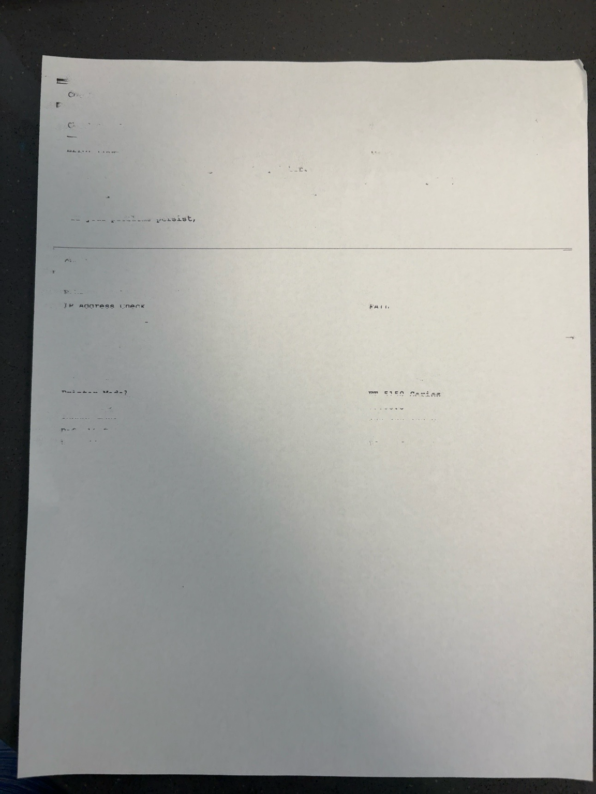

# Epson ET-5150 Wireless Printer Troubleshooting

## Project Summary

This project documents a real-world printer troubleshooting case involving an Epson ET-5150 printer that displayed a Wi-Fi system error while also producing nearly blank pages.

The issue was resolved using a structured troubleshooting methodology commonly used in IT Support and Help Desk environments.
----
## Ticket Summary

**Issue:** Shared Epson ET-5150 would not print from multiple Windows computers and produced extremely faint internal reports.

**Impact:** Printing was unavailable across the office systems connected to the shared printer.

**Resolution:** Isolated the issue through multi-device testing, reviewed printer-generated errors, identified severe print-quality degradation, ran the built-in nozzle-cleaning process, and verified that normal printing returned.

**Status:** Resolved
-----
## Environment

- Epson ET-5150 Wireless Printer
- Windows PCs
- Wireless Network
- Multiple client computers

---

## Problem
## Initial Evidence

The printer was listed in Windows with an error status, and printing failed from multiple connected computers. Because the same symptoms appeared across more than one workstation, I treated the issue as a shared printer or network problem rather than a single-computer failure.
Users reported:

- Printer appeared offline
- Wi-Fi System Error 202620
- Extremely faint printing
- Missing text
- Blank pages

---

## Troubleshooting Process

### Step 1
Verified printer hardware by printing directly from the printer.

Result:
Printer successfully fed paper.

---

### Step 2
Printed Printer Connection Check Report.
### Connection Check Result

The printer reported that it was not connected to the network.

Result:

- Printer printed extremely faint output.
- Determined printer hardware was functioning.
- Suspected printhead issue.

---

### Step 3
Investigated Wi-Fi System Error 202620.
### Wi-Fi System Error

When I attempted to access or restore wireless connectivity, the printer displayed system error code 202620.

Observed:

- Printer displayed Wi-Fi System Error.
- Network configuration unavailable.

---

### Step 4
Observed poor print quality.
### Print Quality Evidence

The connection report was produced, but the text was extremely faint and portions were missing. This showed that the printer could physically feed paper while also indicating a separate ink-delivery or printhead problem.

Symptoms:

- Missing text
- Blank sections
- Very light printing

---

### Step 5
Performed Printer Maintenance.
### Nozzle Check and Cleaning

I used the printer’s built-in maintenance menu to run a nozzle check and head-cleaning cycle.

Maintenance

- Nozzle Check
- Head Cleaning

---
## Resolution

The printer’s built-in nozzle-cleaning process restored normal print quality. After cleaning, documents began printing successfully again.

## Root Cause Assessment

The confirmed print-quality problem was clogged or obstructed printhead nozzles, supported by the extremely faint output and the successful result after nozzle cleaning.

A Wi-Fi system error was also observed during troubleshooting. Because printing ultimately resumed, the wireless condition was treated as a secondary or intermittent issue rather than a confirmed hardware failure. If it returns, the next steps would include checking firmware, resetting network settings, confirming the printer’s IP address, and testing connectivity from each workstation.

## Outcome

- Restored normal print quality
- Restored printing from the office systems
- Avoided unnecessary printer replacement
- Documented the incident for future troubleshooting

## IT Skills Demonstrated

- Structured Troubleshooting
- Root Cause Analysis
- Hardware Diagnostics
- Network Troubleshooting
- Windows Printer Support
- Printer Maintenance
- Problem Isolation
- Verification Testing
- Multi-device Troubleshooting
